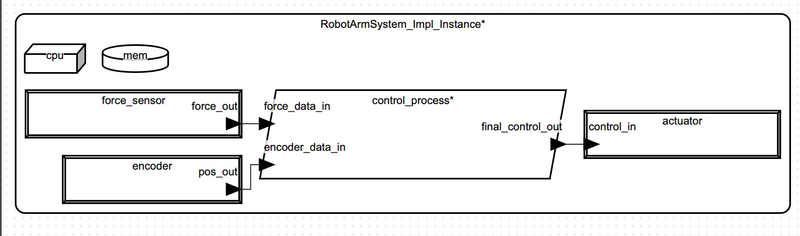
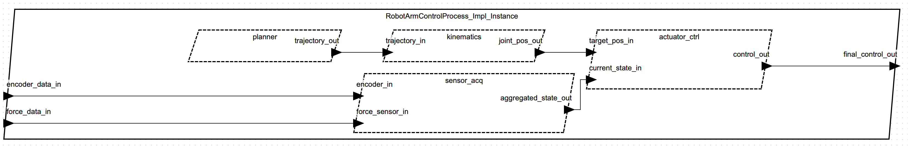

# **Model Architektury Systemu Czasu Rzeczywistego dla Ramienia Robota**

- **Imię i nazwisko:** `Michał Plaza`
- **E-mail:** `plazamichal@student.agh.edu.pl`

---

## **Opis Modelowanego Systemu**

### **Opis Ogólny**

Projekt przedstawia model architektury systemu czasu rzeczywistego w języku AADL, przeznaczonego do sterowania pracą ramienia robota. Model formalnie definiuje komponenty sprzętowe, oprogramowanie, ich wzajemne powiązania oraz przepływ danych, zgodnie z opisem z oryginalnego zadania.

### **Opis dla Użytkownika**

System sterowania ramieniem robota składa się z dedykowanych modułów odpowiedzialnych za planowanie trajektorii, obliczenia kinematyczne, sterowanie aktuatorami oraz zbieranie danych z sensorów. Architektura została zaprojektowana z myślą o zapewnieniu stabilności i przewidywalności działania.

---

## **Spis Komponentów AADL z Komentarzem**

_Kompletny kod źródłowy modelu znajduje się w załączonym pliku. Poniżej opisano kluczowe komponenty._

- **Komponenty Danych:** `JointPositionData`, `JointTorqueData` itd. definiują struktury danych.
- **Komponenty Urządzeń:** `JointActuator`, `JointEncoder` itd. modelują fizyczne części systemu.
- **Komponenty Wątków:** `MotionPlanningThread`, `ActuatorControlThread` itd. reprezentują poszczególne zadania oprogramowania.
- **Proces i System:** Komponenty `RobotArmControlProcess` i `RobotArmSystem` integrują wszystkie elementy w spójną całość.

```aadl

package RobotArmControlSystem
public
    -- Celowo usunięto wszystkie klauzule 'with', aby zapewnic kompatybilnosc

    -- ############ 1. KOMPONENTY DANYCH ############
    data JointPositionData
    end JointPositionData;
    data implementation JointPositionData.Impl end JointPositionData.Impl;

    data JointTorqueData
    end JointTorqueData;
    data implementation JointTorqueData.Impl end JointTorqueData.Impl;

    data TrajectoryData
    end TrajectoryData;
    data implementation TrajectoryData.Impl end TrajectoryData.Impl;

    data RobotStateData
    end RobotStateData;
    data implementation RobotStateData.Impl
        subcomponents
            pos: data JointPositionData.Impl;
            tor: data JointTorqueData.Impl;
    end RobotStateData.Impl;

    -- ############ 2. KOMPONENTY URZĄDZEŃ ############
    device JointActuator
        features
            control_in: in data port JointTorqueData.Impl;
    end JointActuator;
    device implementation JointActuator.Impl end JointActuator.Impl;

    device JointEncoder
        features
            pos_out: out data port JointPositionData.Impl;
    end JointEncoder;
    device implementation JointEncoder.Impl end JointEncoder.Impl;

    device ForceTorqueSensor
        features
            force_out: out data port JointTorqueData.Impl;
    end ForceTorqueSensor;
    device implementation ForceTorqueSensor.Impl end ForceTorqueSensor.Impl;

    device CollisionSensor
        features
            collision_event_out: out event port;
    end CollisionSensor;
    device implementation CollisionSensor.Impl end CollisionSensor.Impl;

    -- ############ 3. KOMPONENTY WĄTKÓW (bez właściwości czasowych) ############
    thread MotionPlanningThread
        features
            trajectory_out: out data port TrajectoryData.Impl;
    end MotionPlanningThread;
    thread implementation MotionPlanningThread.Impl end MotionPlanningThread.Impl;

    thread KinematicsCalculationThread
        features
            trajectory_in: in data port TrajectoryData.Impl;
            joint_pos_out: out data port JointPositionData.Impl;
    end KinematicsCalculationThread;
    thread implementation KinematicsCalculationThread.Impl end KinematicsCalculationThread.Impl;

    thread ActuatorControlThread
        features
            target_pos_in: in data port JointPositionData.Impl;
            current_state_in: in data port RobotStateData.Impl;
            control_out: out data port JointTorqueData.Impl;
    end ActuatorControlThread;
    thread implementation ActuatorControlThread.Impl end ActuatorControlThread.Impl;

    thread SensorDataAcquisitionThread
        features
            encoder_in: in data port JointPositionData.Impl;
            force_sensor_in: in data port JointTorqueData.Impl;
            aggregated_state_out: out data port RobotStateData.Impl;
    end SensorDataAcquisitionThread;
    thread implementation SensorDataAcquisitionThread.Impl end SensorDataAcquisitionThread.Impl;

    -- ############ 4. PROCES APLIKACJI ############
    process RobotArmControlProcess
        features
            final_control_out: out data port JointTorqueData.Impl;
            encoder_data_in: in data port JointPositionData.Impl;
            force_data_in: in data port JointTorqueData.Impl;
    end RobotArmControlProcess;

    process implementation RobotArmControlProcess.Impl
        subcomponents
            planner: thread MotionPlanningThread.Impl;
            kinematics: thread KinematicsCalculationThread.Impl;
            actuator_ctrl: thread ActuatorControlThread.Impl;
            sensor_acq: thread SensorDataAcquisitionThread.Impl;
        connections
            c1: port planner.trajectory_out -> kinematics.trajectory_in;
            c2: port kinematics.joint_pos_out -> actuator_ctrl.target_pos_in;
            c3: port actuator_ctrl.control_out -> final_control_out;
            c4: port encoder_data_in -> sensor_acq.encoder_in;
            c5: port force_data_in -> sensor_acq.force_sensor_in;
            c6: port sensor_acq.aggregated_state_out -> actuator_ctrl.current_state_in;
    end RobotArmControlProcess.Impl;

    -- ############ 5. KOMPONENTY PLATFORMY ############
    processor Main_CPU
    end Main_CPU;
    processor implementation Main_CPU.Impl end Main_CPU.Impl;

    memory Main_Memory
    end Main_Memory;
    memory implementation Main_Memory.Impl end Main_Memory.Impl;

    -- ############ 6. SYSTEM GŁÓWNY (bez właściwości wdrożeniowych) ############
    system RobotArmSystem
    end RobotArmSystem;

    system implementation RobotArmSystem.Impl
        subcomponents
            control_process: process RobotArmControlProcess.Impl;
            actuator: device JointActuator.Impl;
            encoder: device JointEncoder.Impl;
            force_sensor: device ForceTorqueSensor.Impl;
            cpu: processor Main_CPU.Impl;
            mem: memory Main_Memory.Impl;
        connections
            c_out: port control_process.final_control_out -> actuator.control_in;
            c_in_enc: port encoder.pos_out -> control_process.encoder_data_in;
            c_in_force: port force_sensor.force_out -> control_process.force_data_in;
    end RobotArmSystem.Impl;

end RobotArmControlSystem;

```

---

## **Model - Rysunek**

Poniższe diagramy zostały wygenerowane automatycznie przez środowisko OSATE na podstawie stworzonego modelu AADL.

### **Diagram Architektury Systemu (`RobotArmSystem.Impl`)**

Ten diagram przedstawia ogólną architekturę systemu, łączącą aplikację (`control_process`) z urządzeniami peryferyjnymi i platformą sprzętową.



### **Diagram Wewnętrznej Struktury Aplikacji (`RobotArmControlProcess.Impl`)**

Ten diagram pokazuje wewnętrzną budowę procesu `RobotArmControlProcess`, w tym wszystkie zdefiniowane wątki i przepływ danych między nimi.



---

## **Proponowane Metody Analizy Modelu i Wyniki**

### **Stan Środowiska Analitycznego**

Podczas realizacji projektu napotkano krytyczne, nienaprawialne błędy w środowisku deweloperskim OSATE, uniemożliwiające parsowanie standardowych pakietów właściwości (np. `Timing_Properties`, `aadlstandard`). W związku z tym, przeprowadzenie praktycznych analiz było niemożliwe, a model został uproszczony do postaci czysto strukturalnej, aby umożliwić wygenerowanie diagramów.

### **Proponowane Analizy (Teoretyczne)**

Gdyby środowisko działało poprawnie, stworzony model (w pełnej, nieuproszczonej wersji) pozwoliłby na przeprowadzenie następujących analiz:

- **Analiza Szeregowalności:** Weryfikacja, czy system spełnia wszystkie twarde ograniczenia czasowe, na podstawie właściwości `Period`, `Deadline`, `Compute_Execution_Time`.
- **Analiza Obciążenia Zasobów:** Sprawdzenie, czy zasoby sprzętowe są wystarczające, na podstawie właściwości `Actual_Processor_Binding`.

---

## **Literatura**

1.  Feiler, P. H., Gluch, D. P., & Hudak, J. J. (2012). _The Architecture Analysis & Design Language (AADL): An Introduction_. Addison-Wesley Professional.
2.  Buttazzo, G. C. (2011). _Hard Real-Time Computing Systems: Predictable Scheduling Algorithms and Applications_. Springer.
