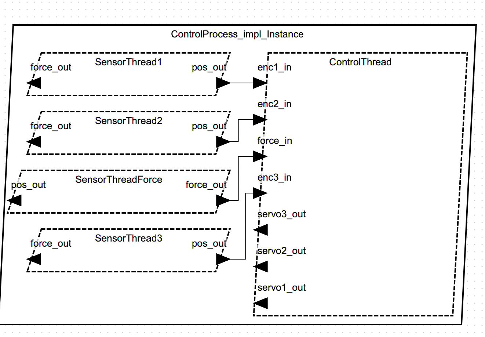
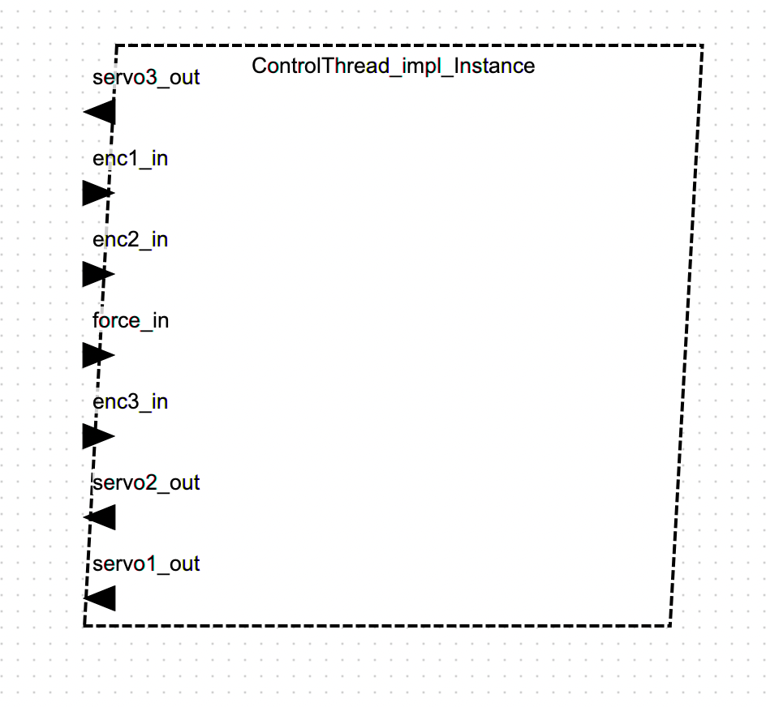
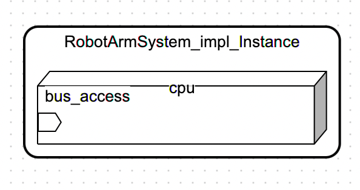
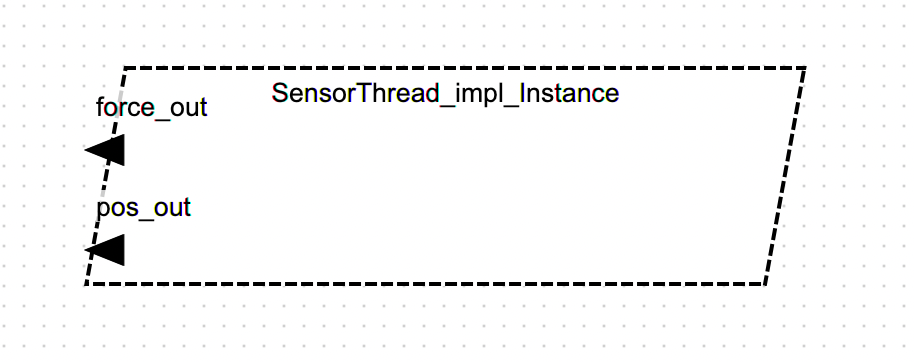

# Sprawozdanie - Projekt Systemu Czasu Rzeczywistego Sterowania Ramieniem Robota w AADL

## Tytuł modelu
System Czasu Rzeczywistego Sterowania Ramieniem Robota

## Dane studenta
Imię i Nazwisko: Michał Plaza
E-mail: plazamichal@student.agh.edu.pl

## Opis modelowanego systemu

### Opis ogólny
Niniejsze sprawozdanie przedstawia projekt systemu czasu rzeczywistego sterowania ramieniem robota, zamodelowanego przy użyciu Architecture Analysis and Design Language (AADL) w środowisku OSATE. Celem projektu jest demonstracja możliwości AADL w zakresie modelowania systemów wbudowanych o krytycznych wymaganiach czasowych, takich jak robotyka. Model obejmuje kluczowe komponenty funkcjonalne i niefunkcjonalne, w tym sterowanie ruchem, akwizycję danych z sensorów, wykrywanie kolizji oraz komunikację.

### Opis dla użytkownika
System sterowania ramieniem robota jest zaprojektowany do precyzyjnego i bezpiecznego manipulowania obiektami w przestrzeni. Składa się z modułów odpowiedzialnych za planowanie trajektorii, obliczenia kinematyczne, sterowanie aktuatorami, zbieranie danych z sensorów (enkodery, czujniki siły/momentu, czujniki kolizji) oraz komunikację z nadrzędnym systemem lub interfejsem użytkownika. System został zaprojektowany z uwzględnieniem wymagań czasu rzeczywistego, co oznacza, że operacje są wykonywane w ściśle określonych ramach czasowych, zapewniając stabilność i przewidywalność działania ramienia robota. W przypadku wykrycia kolizji, system jest w stanie natychmiastowo zareagować, zatrzymując ruch ramienia w celu zapewnienia bezpieczeństwa.

## Spis komponentów AADL z komentarzem

Pełny model AADL znajduje się w pliku `RobotArmControlSystem.aadl`. Poniżej przedstawiono kluczowe komponenty wraz z ich opisem:

### Komponenty Danych (Data Components)
- **`JointPositionData`**: Reprezentuje dane dotyczące pozycji stawów ramienia robota. Używane do przesyłania informacji o aktualnym położeniu oraz zadanych pozycjach.
- **`JointVelocityData`**: Reprezentuje dane dotyczące prędkości stawów.
- **`JointTorqueData`**: Reprezentuje dane dotyczące momentów obrotowych/sił działających na stawy.
- **`TrajectoryData`**: Zawiera sekwencję punktów w przestrzeni, które ramię robota ma osiągnąć. Jest to wynik planowania ruchu.
- **`RobotStateData`**: Agreguje różne dane o stanie robota, takie jak pozycje, prędkości, dane z czujników siły/momentu, itp.

### Komponenty Urządzeń (Device Components)
- **`JointActuator`**: Modeluje aktuator (np. silnik z przekładnią) odpowiedzialny za ruch pojedynczego stawu. Posiada port wejściowy do sterowania i port wyjściowy do raportowania pozycji.
- **`JointEncoder`**: Modeluje enkoder, czyli czujnik mierzący pozycję kątową stawu. Posiada port wejściowy do odczytu danych i port wyjściowy do udostępniania zmierzonej pozycji.
- **`ForceTorqueSensor`**: Reprezentuje czujnik siły/momentu, dostarczający dane o siłach i momentach działających na ramię robota.
- **`CollisionSensor`**: Modeluje czujnik wykrywający kolizje. Generuje zdarzenie w przypadku wykrycia kolizji.

### Komponenty Wątków (Thread Components)
- **`MotionPlanningThread`**: Odpowiedzialny za planowanie trajektorii ruchu ramienia robota. Generuje `TrajectoryData`.
  - **Właściwości czasu rzeczywistego:** `Period` (100 ms), `Compute_Execution_Time` (10-20 ms), `Deadline` (90 ms), `Priority` (10).
- **`KinematicsCalculationThread`**: Oblicza kinematykę ramienia robota na podstawie zadanej trajektorii, przekształcając ją na zadane pozycje stawów (`JointPositionData`).
  - **Właściwości czasu rzeczywistego:** `Period` (50 ms), `Compute_Execution_Time` (5-10 ms), `Deadline` (40 ms), `Priority` (15).
- **`ActuatorControlThread`**: Odpowiada za sterowanie poszczególnymi aktuatorami w celu osiągnięcia zadanych pozycji stawów. Generuje sygnały sterujące (`control_out`).
  - **Właściwości czasu rzeczywistego:** `Period` (20 ms), `Compute_Execution_Time` (2-5 ms), `Deadline` (15 ms), `Priority` (20).
- **`SensorDataAcquisitionThread`**: Zbiera dane z różnych sensorów (enkoderów, czujników siły/momentu) i agreguje je w `RobotStateData`.
  - **Właściwości czasu rzeczywistego:** `Period` (10 ms), `Compute_Execution_Time` (1-3 ms), `Deadline` (8 ms), `Priority` (25).
- **`CollisionDetectionThread`**: Analizuje `RobotStateData` w celu wykrycia potencjalnych kolizji. W przypadku wykrycia, generuje zdarzenie `collision_event_out`.
  - **Właściwości czasu rzeczywistego:** `Period` (5 ms), `Compute_Execution_Time` (0.5-1 ms), `Deadline` (4 ms), `Priority` (30).
- **`CommunicationThread`**: Odpowiedzialny za komunikację z zewnętrznymi systemami (np. interfejsem użytkownika), wysyłając `RobotStateData`.
  - **Właściwości czasu rzeczywistego:** `Period` (200 ms), `Compute_Execution_Time` (10-30 ms), `Deadline` (180 ms), `Priority` (5).

### Komponenty Procesów (Process Components)
- **`RobotArmControlProcess`**: Reprezentuje główny proces sterowania ramieniem robota, agregujący wszystkie wątki i urządzenia. Posiada porty do odbierania komend użytkownika i wysyłania statusu robota.

### Implementacja Systemu (System Implementation)
- **`RobotArmControlSystem_i`**: Jest to implementacja systemu, która łączy wszystkie zdefiniowane komponenty (wątki, urządzenia) za pomocą połączeń danych i zdarzeń. Odzwierciedla architekturę systemu sterowania ramieniem robota, pokazując przepływ danych i interakcje między modułami.

## Model - diagramy

## Literatura

- P. Feiler, D. Gluch, J. Hudak, The Architecture Analysis & Design Language (AADL): An Introduction. Addison-Wesley Professional, 2006.
- OSATE Documentation: [https://osate.org/documentation.html](https://osate.org/documentation.html)
- AADL Standard: SAE AS5506B, Architecture Analysis and Design Language (AADL) Standard.

